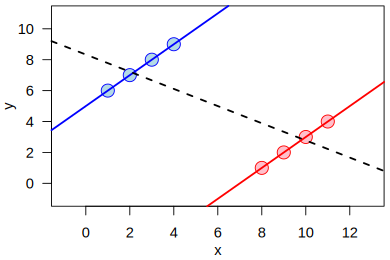

# Causality

## Simpson's Paradox: Does Statistics Tell the Truth?

We start with Simpson's paradox, a well-known phenomenon in statistics in which consistent trends within all subgroups do not necessarily translate into the same trend in the overall population. The following three tables are borrowed from a real medical study (Charig et al., 1986; Julious and Mullee, 1994), which give an example of such paradox. In the study, two surgical plans, labelled respectively by treatment A and B, are provided for patients with kidney stones. In the analysis stage, the data are stratified based on sizes of kidney stones, and success rates of the surgeries are computed for the strata and the sample. It is surprising that, while treatment A is more effective in handling small stones and also big stones, it is less effective than treatment B regarding the entire sample.

| small stones | success | failure | sucess rate |
| ------------ | ------- | ------- | ----------- |
| treatment A  |  81     |   6     |  **93%**    |
| treatment B  |  234    |   36    |  84%        |

| big stones   | success | failure | sucess rate |
| ------------ | ------- | ------- | ----------- |
| treatment A  |  192    |   71    |  **73%**    |
| treatment B  |  55     |   25    |  69%        |

| both         | success | failure | sucess rate |
| ------------ | ------- | ------- | ----------- |
| treatment A  |  273    |   77    |  78%        |
| treatment B  |  289    |   61    |  **83%**    |

The Simpson's paradox is counterintuitive because of long-standing misunderstandings of correlation and causation. Conclusions based on association analysis are not able to unveil the causal relationships between two variables or events. In the kidney stone study, the effects of the two treatments are confounded with the effects of the sizes of kidney stones: treatment B is overall more effective because it is applied more often to small stones, which are easier to handle.

## Causality

>Causality is a fundamental concept in our universe. Causal inference focuses on demystifying causality from data using statistical methods.

Causality is about causes and effects. It has never been explicitly defined and philosophical debate on this concept has been lasting for centuries. However, over the past decades, substantial progress has been made on the methods of quantifying causality based on experimental or observational data. This online material will focus on causal inference with experimental data.

This example is borrowed from Rubin and Imbens (2015): an individual experienced a headache, took an aspirin, and the headache was removed the second day. How can we justify aspirin as the cause of that headache went away? In causal inference, this reasoning can be based on counterfactuals. One may imagine a parallel universe in which the individual did not take the aspirin. The headache state in the parallel universe is a counterfactual outcome, and causality arises from comparing the counterfactual outcome with the observed outcome. Suppose we know from god that headache would have persisted in the counterfactual world without aspirin, then the recovery could be legitimately attributed to aspirin. The outcomes in all the possible parallel universes of interest are called potential outcomes, each associated with a parallel universe.

## Neyman-Rubin Causal Model

The notion of potential outcomes was initially proposed by Jerzy Neyman, a Polish mathematician, in the context of randomized experiments, and then substantially developed by Donald Rubin and extended to nonrandomized studies. 

Provided a group of sample units, indexed by $\\{1,2,\cdots,n\\}$, suppose we are interested in the overall effect of a treatment (intervention/exposure/action) of two levels, $a\in\\{0,1\\}$, on an outcome measured after the treatment with respect to the sample units. In the aspirin example, $a=1$ represents taking aspirin and $a=0$ represents not taking it, and the outcome measurement is an indicator of whether headache is removed (or relieved). Then, for each unit $i$, there are two potential outcomes, denoted by $Y_i(1)$ and $Y_i(0)$, associated respectively with $a=1$ and $a=0$. A natural metric of causality is the sample average treatment effect (ATE),
$$
\tau = \frac{1}{n}\sum_{i=1}^n [Y_i(1) - Y_i(0)].
$$
A fundamental issue of causal inference is that the potential outcomes are not simultaneously observable. Each sample unit chooses to take aspirin or not, and we observe either $Y_i(1)$ or $Y_i(0)$, but not noth. This is where randomization steps in like a magician: despite the fundamental difficulty, we can still identify $\tau$ in randomized experiments when the sample size is sufficiently large.

## The Role of Randomization

A crucial problem in causal inference is to decide which potential outcome to observe for each sample unit, called treatment assignment mechanism. Typically, we say a unit is treated or in the treatment group if $Y_i(1)$ is observed, otherwise it is in the control. The treatment assignment mechanism is controlled by experimenters in experiments, whereas it is observed rather than designed in observational studies. Randomization refers to a general class of treatment assignment mechanisms.

In randomized experiments, the treatment assignment mechanism is probabilistic---each individual has a pre-specified probability to be treated. The treatment indicators are random variables and independent of unmeasured confounding factors. Regarding the role of randomization, it is commonly believed that:

* Randomization mitigates confounding bias.
* Randomization balances confounding variables between groups, making the two treatment groups comparable.

In the view of statistics, a more accurate statement is:

* Randomization ensures that the causal quantities of interest are identifiable in statistical analysis without requiring further strong and untestable model assumptions.

Let us take a look at the arguably simplest randomization method---fair coin, where each unit has a chance of $p=0.5$ to be treated and treatment assignments are independent of each other. Let $A_i$ denote the treatment indicator for unit $i$. It follows that $(A_1,\cdots,A_n)\sim B(n,p=0.5)$ and the observed outcomes are $Y_i=Y_i(A_i)$. Let $n_1$ and $n_0$ be the sample sizes of the treated and the control. Then, the difference in sample means 
$$
\hat{\tau} = \bar{Y}\_1 - \bar{Y}\_0 =  \frac{1}{n_1}\sum_{i=1}^nA_iY_i - \frac{1}{n_0}\sum_{i=1}^n(1-A_i)Y_i
$$
is an unbiased and consistent estimator of $\tau$ under mild conditions. The proof is left as an exercise.

## Randomization-Based versus Model-Based Causal Inference

An ongoing debate in causal inference with experimental data is that whether we should take the potential outcomes as random variables. Randomization-based causal inference views potential outcomes as fixed values where randomness comes solely from treatment assignments, whereas model-based causal inference typically assumes that the potential outcomes are independent and identically distributed random variables.

The two settings are conceptually and technically different. In randomization-based causal inference, the parameter of common interest is the ATE over the sample. In model-based causal inference, the parameter of interest is the ATE over a hypothetical population from which the sample units are drawn. Therefore, model-based causal inference is more appropriate if our target population is universal. Randomization-based causal inference relaxes the model assumptions such as independence, and statistical analysis is solely based on randonmness in the design stage, which is indeed a significant relaxation and fits in the real-world complex data. However, randomization-based causal inference is also more techinically difficult and strong finite-population moment assumptions are still required to guarantee large-sample properties of the treatment effect estimators.

To facilitate theoretical analysis, thereafter, we will focus on model-based causal inference where the potential outcomes $(Y_i(1),Y_i(0))$ are assumed to be indepedent and identically dsitributed from an infinite superpopulation.

## Revisiting Simpson's Paradox

Let us look back on the Simpson's paradox and see what randomization can help with. Suppose $X_i$ is a binary baseline covariate (indicator of small kidney stones). For simplicity of demonstrattion, we assume $(Y_i,A_i,X_i)$ are i.i.d. from $(Y,A,X)$ and $Y>0$. Simple algebra gives
$$
\begin{aligned}
E(Y\mid A=a)=&P(X=1\mid A=a)E(Y\mid A=a, X=1) \\\\
&+ P(X=0\mid A=a)E(Y\mid A=a, X=0)
\end{aligned}
$$
for $a=0,1$. Let us denote $\delta=E(Y\mid A=1)-E(Y\mid A=0)$ and $\delta_x=E(Y\mid A=1,X=x) - E(Y\mid A=0,X=x)$. The Simpson's paradox, in statistical language, states that while $\delta_x>0$ for $x=0,1$ we can still obtain $\delta < 0$, which occurs when $\delta_1 < \delta_0$ and $P(X=1\mid A=1) > \delta_0/(\delta_0-\delta_1)$.

For continuous $X$, we have 
$$
\delta = \int \delta_x p(x\mid 1) dx - \int E(Y\mid A=0,X=x)[p(x\mid 0)-p(x\mid 1)]dx
$$
where $p(x\mid a)$ is the density of $X$ in the treatment group $A=a$. The Simpson's paradox occurs when $\delta_x>0$ for all $x$ and
$$
\int \delta_x p(x\mid 1) dx < \int E(Y\mid A=0,X=x)[p(x\mid 0)-p(x\mid 1)]dx.
$$

The paradox is further illustrated by the following figure.

{align = center}
/// caption
Source: <a href="//commons.wikimedia.org/wiki/User:Schutz" title="User:Schutz">Schutz</a> - Own work, Public Domain, <a href="https://commons.wikimedia.org/w/index.php?curid=2240877">Link</a>
///

Under randomization, $A$ is independent of $X$ and $p(x\mid 1)=p(x\mid 0)$. Therefore, $\delta=\int \delta_x p(x\mid 1) dx$, which rules out the possibility of Simpson's paradox. Furthermore, randomization guarantees that the causal quantity $E[Y(a)]=E(Y\mid A=a)$ is identifiable from observed data.

## Suggested Books and Papers

<cite>Ding, P. (2024). A First Course in Causal Inference. Chapman and Hall/CRC.</cite>

## Exercises

**1.1.** Explain Simpson's paradox based on Pearson correlation coefficient.

**1.2.** Suppose the potential outcomes are fixed values and treatment indicators are Bernoulli trials, prove that $\hat{\tau} = \bar{Y}\_1 - \bar{Y}\_0$ is an unbiased and consistent estimator of $\tau = \frac{1}{n}\sum_{i=1}^n [Y_i(1) - Y_i(0)]$ under certain regularity conditions and present these conditions.

**1.3.** Can you find an alternative approach other than potential outcomes to quantify causality?

## References

<cite>Charig, C. R., Webb, D. R., Payne, S. R., & Wickham, J. E. (1986). Comparison of treatment of renal calculi by open surgery, percutaneous nephrolithotomy, and extracorporeal shockwave lithotripsy. Br Med J (Clin Res Ed), 292(6524), 879-882.</cite>

<cite>Julious, S. A., & Mullee, M. A. (1994). Confounding and Simpson's paradox. The BMJ, 309(6967), 1480-1481.</cite>

<cite>Imbens, G. W., & Rubin, D. B. (2015). Causal Inference in Statistics, Social, and Biomedical Sciences. Cambridge University Press.</cite>

